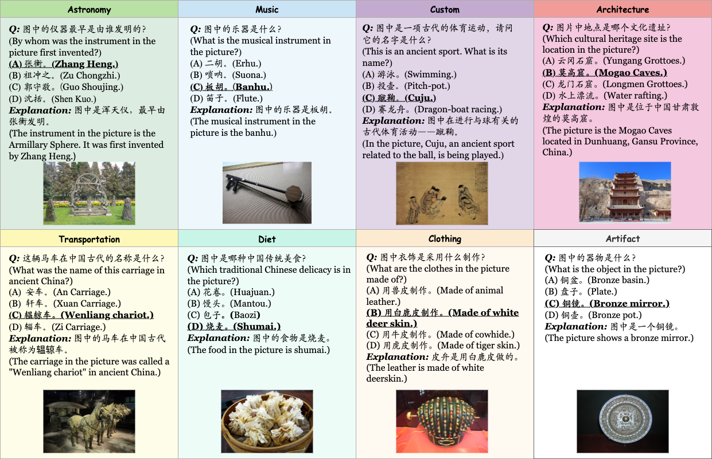

# TCC-Bench: Benchmarking the Traditional Chinese Culture Understanding Capabilities of MLLMs

We present the **T**raditional **C**hinese **C**ulture understanding **Bench**mark, TCC-Bench, a bilingual (*i.e.*, Chinese and English) Visual Question Answering (VQA) benchmark specifically designed to evaluate the capabilities of MLLMs in understanding traditional Chinese culture. We customize eight knowledge domains that encompass key aspects of traditional Chinese culture. Moreover, the images within TCC-Bench are curated from museum artifacts, depictions of everyday life, comics, and other culturally significant materials, ensuring both visual diversity and cultural authenticity. Moreover, we introduce a semi-automated question generation method that reduces manual effort while ensuring the acquisition of high-quality data. Samples from our dataset are shown in the following figure.



## Dataset Availability

The dataset is available at [Google Drive](https://drive.google.com/file/d/1EbjSu_pTMQuIG7wqYZIQC5Y66DCClQdR/view?usp=sharinghttps:/).

## How to Run

### Inference

We use [LMdeploy](https://github.com/InternLM/lmdeployhttps:/) framework to deploy and accelerate MLLMs. Run the command below to create the evaluation environment.

```
conda create -n lmdeploy python=3.8 -y
conda activate lmdeploy
pip install lmdeploy
```

Then, configure the model settings within `infer/models/__init__.py`, Taking **InternVL3.5-8B** as an example, you can set the following parameters:

```
'InternVL3.5-8B': {
        'load': ('.lmdeploy_chat', 'load_model'),
        'infer': ('.lmdeploy_chat', 'infer'),
        'model_path_or_name': '/path/to/InternVL3.5-8B',
        'call_type': 'local',
        'tp': 1
    }
```

Run the command below to infer:

```
python infer/infer.py --prompt_template prompt_zh.yaml --model_name InternVL3.5-8B --output_dir results_tcc --batch_size 1 --use_accel
```

### Evaluation

Run this command to evaluate:

```
python eval/eval.py
```

## Acknowledgements

Code is built from [CII-Bench](https://github.com/MING-ZCH/CII-Bench). We thank the authors for releasing their code.
